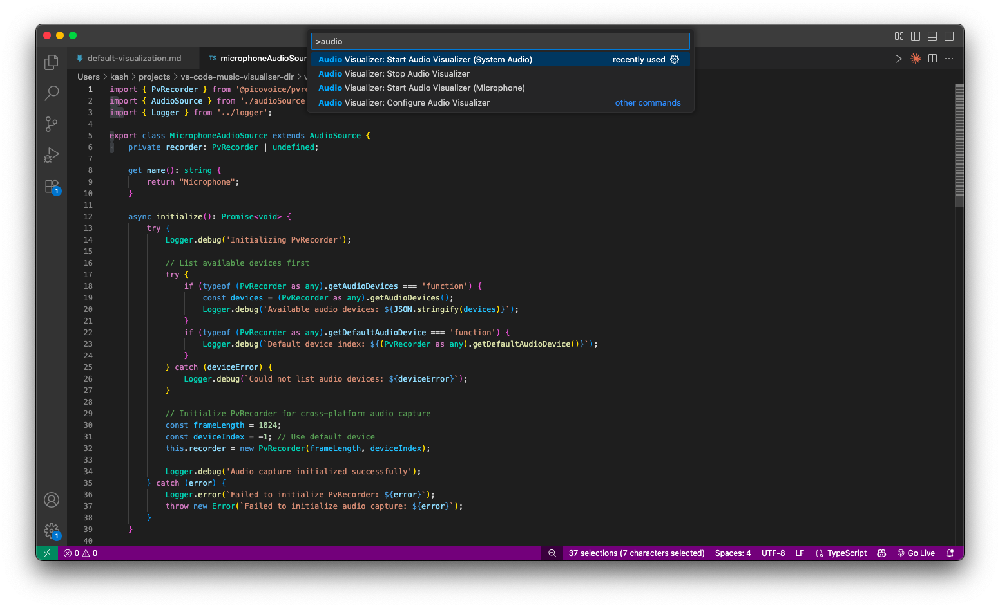

# 🎵 VS Code Music Visualizer

Transform your code editor into a real-time music visualizer using multiline cursors. Watch code dance to music as frequency analysis drives dynamic cursor positioning.

## Installation

1. Open VS Code Extensions (`Ctrl+Shift+X` / `Cmd+Shift+X`)
2. Search "Multiline Cursor Audio Visualizer"
3. Click **Install**

[Install from Marketplace →](https://marketplace.visualstudio.com/items?itemName=ark-tik.multiline-cursor-audio-visualizer)

## Gallery & Usage

### Live Visualization (youtube video)

Real-time cursor movement responding to audio frequencies - each cursor represents a frequency band positioned by amplitude.

### Available Commands

Access via Command Palette (`Ctrl+Shift+P`):
- **Audio Visualizer: Start (Microphone)** - Captures microphone input for live performance visualization
- **Audio Visualizer: Start (System Audio)** - Captures computer audio output for music visualization
- **Audio Visualizer: Stop** - Stops the visualization
- **Audio Visualizer: Configure** - Opens extension settings

### Configuration Settings

Customize through VS Code settings:
- **Sensitivity** (0.1-5.0) - Audio response strength
- **Update Rate** (30-120 FPS) - Visualization refresh rate
- **Cursor Count** (8-256) - Number of frequency bands
- **Auto Configure** - Matches cursor count to visible lines
- **Smoothing** (0.0-1.0) - Movement fluidity
- **Debug Logging** - Troubleshooting output

## Setup Instructions

### Microphone Mode (Works Immediately)
1. Open any text file
2. Run "Audio Visualizer: Start (Microphone)"
3. Start speaking/playing music - cursors respond instantly

### System Audio Mode

#### macOS Setup (Required)
System audio requires additional setup on macOS:

**Step 1: Create Multi-Output Device**

- Open **Audio MIDI Setup** (`/Applications/Utilities/`)
- Click **+** → **Create Multi-Output Device**

**Step 2: Configure Device**

- Check **Built-in Output**
- Check **BlackHole 2ch** ([Download BlackHole](https://github.com/ExistentialAudio/BlackHole))
- Enable **Drift Correction** for Built-in Output only

**Step 3: Select Audio Output**

- Open **System Settings** → **Sound**
- Select your new **Multi-Output Device**

**Step 4: Start Visualization**
- Run "Audio Visualizer: Start (System Audio)"
- Play music - cursors respond to system audio

> ⚠️ **Note** ⚠️: When Multi-Output Device is selected, volume controls are disabled. Switch back to Built-in Output for normal volume control.

#### Windows/Linux
- **Windows**: Enable "Stereo Mix" in Sound settings
- **Linux**: Extension detects PulseAudio monitor devices automatically

## Use Cases

- **🖥️ Dual Monitor Setup**: Open visualizer in separate VS Code window on second monitor for ambient visual experience
- **🎵 Music Visualization**: Use system audio mode to create live music visuals while working
- **🎙️ Live Streaming**: Use microphone mode during coding streams for interactive audio visualization
- **🎤 Presentations**: Demonstrate with live audio visualization effects

## Troubleshooting

**No Audio Detected**:
- Check microphone permissions for VS Code
- Try microphone mode first to verify extension works
- Enable debug logging in settings

**Performance Issues**:
- Lower update rate to 30 FPS
- Reduce cursor count
- Disable debug logging

## Documentation

For curious developers and contributors:

- 📖 **[How It Works](docs/HOW-IT-WORKS.md)** - Audio processing and FFT explained
- 🏗️ **[Architecture](docs/ARCHITECTURE.md)** - Technical architecture overview  
- 🔧 **[Development](docs/DEVELOPMENT.md)** - Build from source and contribute

---

**Made with ❤️ for VS Code community** • [MIT License](LICENSE)
